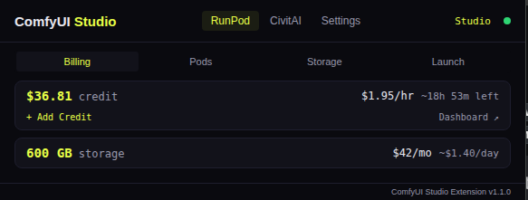
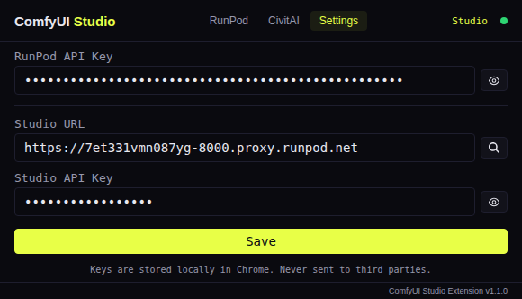
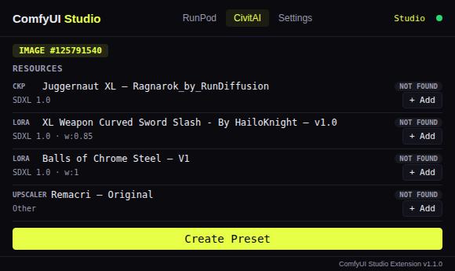
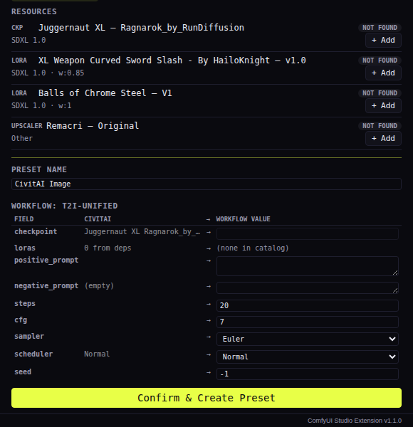

# ComfyUI Studio — Chrome Extension

Browser companion for [ComfyUI Studio](https://github.com/diego-devita/comfyui-studio) — manage RunPod GPU pods and browse CivitAI with Studio integration.

## Screenshots

| RunPod Billing | Settings |
|---|---|
|  |  |

| CivitAI Image Resources | Preset Mapping |
|---|---|
|  |  |

## Features

### RunPod
- Pod management: view, launch, stop, resume, terminate
- Billing: credit balance, spend rate, estimated time remaining
- Storage: network volumes with cost breakdown
- GPU selection with sort, favorites, region, and availability check
- Auto-retry resume/launch when GPU unavailable (configurable interval 5s–30s)
- GPU name badge, network volume badge on pod cards

### CivitAI
- Model pages: see all versions with catalog status (downloaded / in catalog / missing)
- Image pages: view resources, detect hidden dependencies from prompt LoRA tags and embeddings
- Add models to catalog and queue downloads with one click
- Create presets from CivitAI images with full parameter mapping and workflow auto-selection

### Side Panel
- Opens as a side panel (no popup) — click the extension icon to open/close
- Stays open when switching tabs/windows
- Auto-refreshes CivitAI page detection on navigation
- Minimum width enforcement (680px) with forbidden overlay

### Notifications
- Webhook notifications for pod events (ready, launched, retry success)
- Configurable URL, method, headers, body template with variables
- Test notification button

### Status
- Online/Offline status badge in header with color-coded border and hover
- Connection polling toggle (enable/disable, persisted)
- Green icon bar when connected to Studio, red when disconnected
- Status banner in fixed bottom bar (no layout shift)
- Click version number to view changelog
- About dialog with version, description, attributions

### Permissions
- `storage` — save settings
- `tabs` — detect CivitAI pages
- `sidePanel` — persistent side panel mode
- `activeTab` — detect current tab URL from side panel

## Install

### From Studio (recommended)
1. Open ComfyUI Studio → Settings
2. Click "Download Chrome Extension"
3. Unzip and load in `chrome://extensions` with Developer Mode enabled

### From source
1. Clone the repo
2. Go to `chrome://extensions`, enable Developer Mode
3. Click "Load unpacked" and select the `chrome-extension/src/` directory

## Setup

1. Click the extension icon to open the side panel
2. Go to **Settings** tab
3. Enter your **RunPod API Key** ([runpod.io/console/user/settings](https://www.runpod.io/console/user/settings))
4. Enter your **Studio URL** (e.g. `https://PODID-8000.proxy.runpod.net`) — or use the search button to find running pods
5. Enter your **Studio API Key** (the password you set for ComfyUI Studio)
6. Click Save

## Structure

```
chrome-extension/
├── README.md          ← this file
├── STORE.md           ← Chrome Web Store description
├── src/               ← extension source (load this in Chrome)
│   ├── manifest.json
│   ├── popup.html
│   ├── popup.js
│   ├── popup.css
│   ├── icons.css
│   ├── background.js
│   ├── CHANGELOG.md
│   └── icons/
├── screens/           ← screenshots (originals + cropped)
└── dist/              ← built ZIP for distribution
```

## Permissions

- `storage` — save settings locally
- `tabs` — detect CivitAI pages
- `host_permissions` — RunPod API, RunPod proxy, CivitAI API
